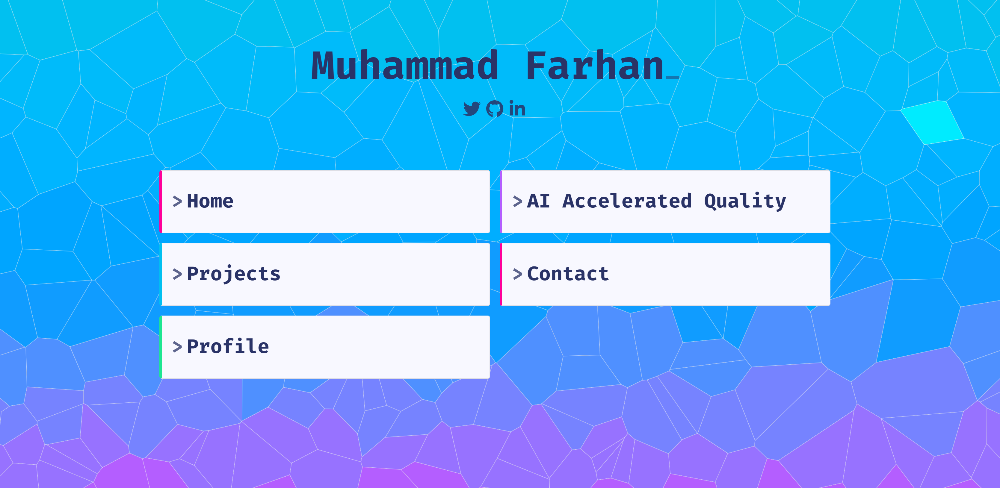

<h1 align="center">✨ Im Farhan!</h1>
<p align="center">
  <i>A re-usable aggregated portfolio and blog site for developers</i><br>
  <b><a href="https://engr-farhan.netlify.app/">engr-farhan.netlify.app</a></b>
</p>
<p align="center">
  <a href="https://engr-farhan.netlify.app/">
    
  </a>
</p>


## Intro

This is my personal website. It's configurable, so feel free to use it, or any parts of it for yourself :)

**About**<br>
A self-hosted developer homepage, to showcase your projects, posts, coding stats, and more.<br>
Data is fetched from external sources (GitHub, RSS, social platforms...), so no need for a CMS.<br>
Crafted with SvelteKit + TypeScript- prioritising SEO, performance, accessibility, and compatibility.<br>

**Contents**
- [**Intro**](#intro)
- [**Usage Guides**](#developing)
  - [Developing](#developing)
  - [Deploying](#deploying)
  - [Configuring](#configuring)


### Pages

<details>
  <summary><b>Portfolio Page</b> - Displays projects from GitHub</summary>

The portfolio page displays the projects yoIu've built. Data is fetched from your GitHub profile, with optional extra fields added in the config.

Each project can include: name, description, thumbnail, language, star/fork/issue count, license, size, date create/updated and links to the repo and project website. Featured projects can be made to span multiple cells, in order to display more info. When a thumbnail is present, the user can hover over the card to view full details. There's sorting and filtering options, useful if you've got a few hundred projects. Data is fetched dynamically from GitHub, but you can add or override any project data in the config file, as well as manually add more projects.


</details>

<details>
  <summary><b>Blog Page</b> - Displays articles from RSS</summary>

The blog page displays posts that I've published. Data is fetched and aggregated from one or more RSS feeds, wordpress, LinkedIn Newsletter defined in the config. Post content is rendered as HTML, as well as metadata including author, date, link to original and optional thumbnail. The user can start typing to filter results, and use the keyboard to navigate posts.


</details>

<details>
  <summary><b>Contact Page</b> - Contact form, and social media summary</summary>
  
The contact page includes links to social profiles, a contact form.


</details>

<details>
  <summary><b>About Page</b> - Displays bio, work experience, tech stack</summary>

The about page has space for a short bio, profile image, work experience and tech stack.


</details>

### Tech

<details>
  <summary><b>Quality Gates</b></summary>

✅ Localized with multi-language support<br>
✅ Unit tested<br>
✅ Fast load speeds<br>
✅ Server-side rendering for good SEO<br>
✅ Meets accessibility standards<br>
✅ Fully responsive<br>


</details>

<details>
  <summary><b>Tech Stack</b></summary>

Built with Svelte, using SvelteKit (1.0.0) and written in TypeScript.
The build system is Vite/ Rollup, with dependencies managed with PNPM.
Standards implemented with ESLint and Prettier, with testing done using Vitest and Playwright.
Styles are composed in SCSS with CSS variables for theming.
There's an optional Dockerfile with a Deno web server.

</details>

---

## Get started 


# 2. Install dependencies
pnpm install

# 3. Start the development server
pnpm run dev -- --open
```

---

## Deploying

### Manual Deploy

- Fork the repo, then follow the steps above to clone and install dependencies
- Make any desired changes (see [Configuring](#configuring) below)
- Push changes to your repository
- Enable the build action, to deploy to a service of your choice

You can also build the site yourself `npm run build`, then either run `node build` to start the server, or use an appropriate [adapter](https://kit.svelte.dev/docs/adapters) for your target environment.

